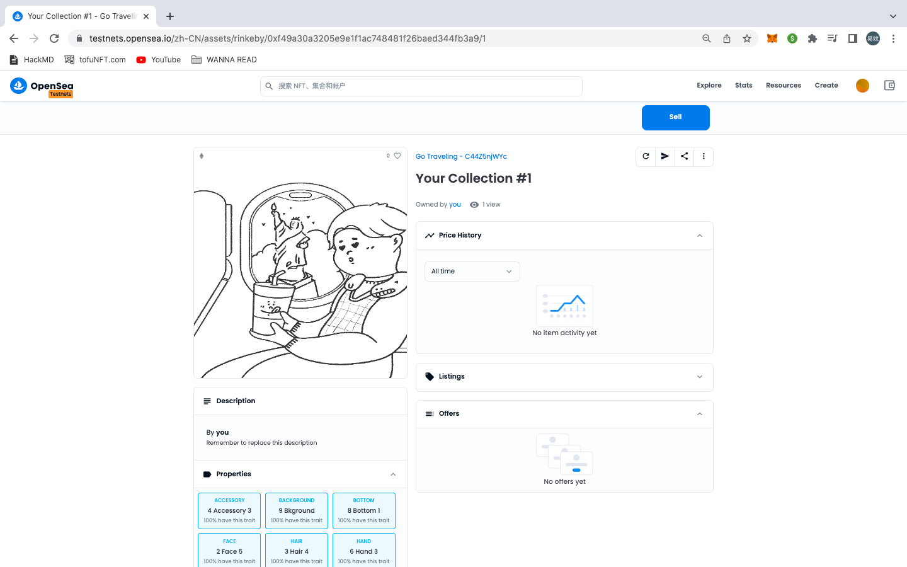

# NFT - Travel Ticket


on testnet rinkeby: https://rinkeby.etherscan.io/address/0xf49a30a3205E9E1f1AC748481f26BAeD344Fb3A9

### \* wait to modify:

-   erc721A

<br>

## Usage

use package hardhat...

### Deploy the Contract

-   all contract

    ```
    // assign network
    yarn hardhat deploy --network rinkeby

    // local network
    yarn hardhat deploy
    ```

-   specific contract

    ```
    // tags decide in ./depoly/deploy.js
    yarn hardhat deploy --network rinkeby --tags "XXX"
    ```

<br>

### Verify

Normally, it would verify automatically when deploy<br>
If not, can run

-   without argument

    ```
    yarn hardhat verify --network rinkeby "CONTRACT_ADDRESS"
    ```

-   with argument
    first create an argument.js file

    ```
    yarn hardhat verify --network rinkeby --constructor-args arguments.js "CONTRACT_ADDRESS"
    ```

<br>

### Image & .json

-   IPFS
    use filebase
-   composite image
    [HashLips/hashlips_art_enginePublic
    ](https://github.com/HashLips/hashlips_art_engine)

<br><br>

## Gas Improve

-   use merkle tree than array mapping (3770017->3590968)
-   import Ownable.sol (->3570274)

## Encounter Error

### Error: ENOENT: no such file or directory, open... artifacts/build-info ...

```
yarn hardhat clean
```

<br>
